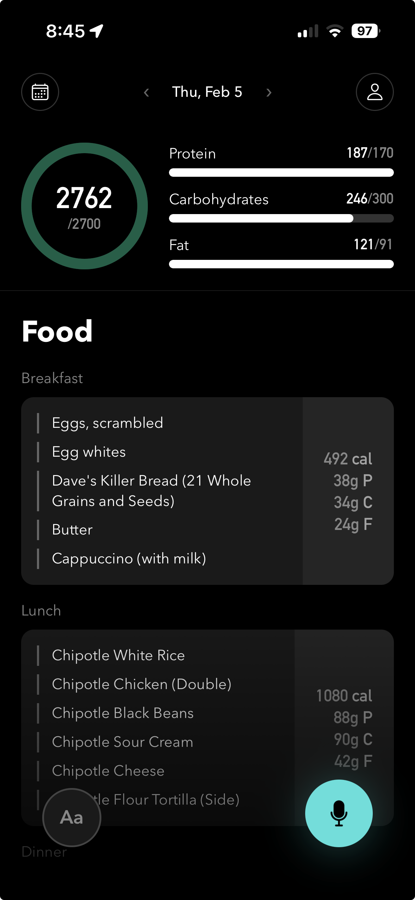

# Hey Macro

Voice-first macro tracking app for iOS. Speak or type what you ate, and an LLM handles the nutritional analysis. Tracks calories, protein, carbs, and fat against daily targets, organized by meal.

Live on TestFlight. Feel free to reach out if you want to try it.

<p align="center">
  
</p>

## Tech Stack

- **React Native + Expo** (TypeScript)
- **expo-sqlite** for local-only storage
- **@react-native-voice/voice** for on-device speech-to-text
- **LLM providers**: OpenAI (gpt-5.2) and Google Gemini (gemini-3-flash) with structured output via Zod schemas
- **No backend** — everything runs on-device except LLM API calls

## Architecture

```
Voice/Text Input
      |
  Speech-to-Text (on-device)
      |
  LLM API (structured JSON output)
      |
  Zod validation + normalization
      |
  SQLite (daily logs, food entries, macro targets)
      |
  React Native UI
```

The app uses a model-agnostic LLM layer (`services/llm.ts`) that supports both OpenAI and Gemini. Gemini 3 Flash is the default — it supports web search grounding + structured output together for accurate nutritional estimates.

Key directories:
- `hooks/` — React state management (app data, voice input, voice+LLM integration)
- `services/` — Business logic (LLM providers, SQLite operations, shared types)
- `screens/` — Screen components (Home, Profile)
- `components/` — Reusable UI components

## Setup

```bash
# Install dependencies
yarn install

# Create .env with your API keys (see .env.example)
cp .env.example .env

# Start Expo dev server
yarn start
```

Press `i` for iOS simulator or scan QR with Expo Go.

## Environment Variables

```
EXPO_PUBLIC_OPENAI_API_KEY=your-openai-api-key
EXPO_PUBLIC_GEMINI_API_KEY=your-gemini-api-key
```

At least one provider key is required. Gemini is the default.
